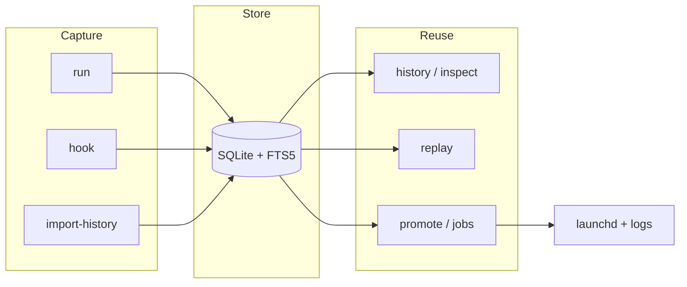
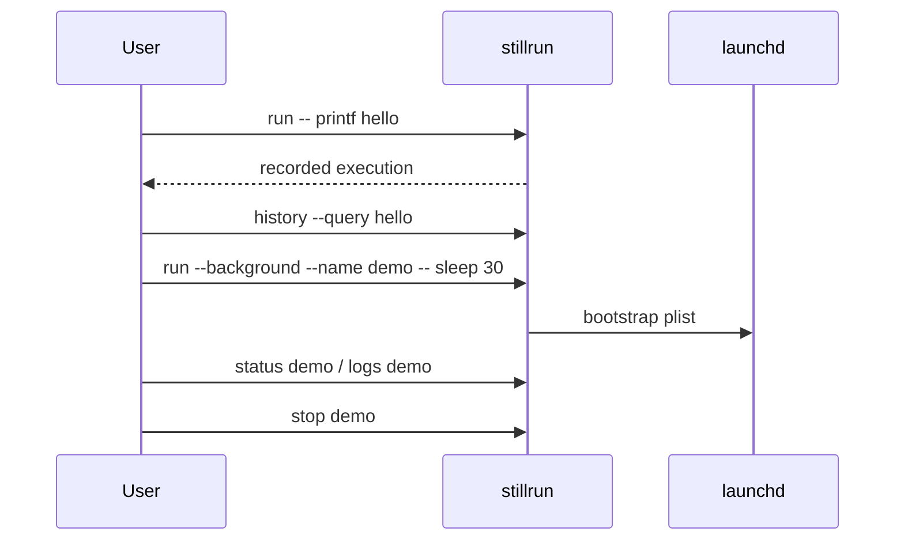

# Stillrun

English | [简体中文](README.zh-CN.md)

macOS CLI for **command history**, **safe replay**, and **launchd-backed Jobs**.

---

## Overview

Stillrun turns terminal commands into searchable, inspectable records. Useful
commands can be promoted into background Jobs with logs, status, and resource
samples—without replacing your shell.

**Primary use cases:** recoverable command history, one-shot or long-running
background work, local Job observability.

**Out of scope:** TUI / Web UI, AI search, remote nodes, Linux / Windows Job
backends (MVP is macOS + launchd only).

Sensitive values are redacted before persistence. Replay restores recorded
non-sensitive environment only—not your current shell session.

---

## Features

| Area | Commands | Description |
| --- | --- | --- |
| Run & record | `run` | Capture argv, cwd, Git, timing, exit status, stdout/stderr, redacted env |
| History | `history` | Search with FTS5 + substring fallback; filter, sort, prune, clear |
| Import | `import-history` | Preview / import local zsh, bash, fish history |
| Replay | `replay` | Re-run from original cwd with recorded non-sensitive env |
| Promote | `promote` | Turn a past execution into a launchd Job |
| Jobs | `jobs`, `status`, `start`, `stop`, `restart` | Lifecycle, dashboard, samples, events |
| Logs | `logs` | Tail or follow Job stdout/stderr |
| Inspect | `inspect` | Human or JSON view of an execution or Job |
| Config | `config` | Local TOML settings and redact-key management |
| Shell integration | `hook`, `completion` | Auto-record future shell commands; tab completion |

---

## Quick start

```bash
./scripts/install.sh
# or non-interactive:
cargo install --path .
```

Verify:

```bash
stillrun -h
stillrun run -- printf 'hello stillrun\n'
stillrun history --query hello
```

The installer can optionally import existing shell history and install a shell
hook after you approve the prompts.

---

## Workflow



**Typical path:** record → search → replay or promote → manage Job lifecycle.



---

## Installation

**Current version:** `0.1.0` (source install)

| Method | Command |
| --- | --- |
| Interactive | `./scripts/install.sh` |
| Non-interactive | `cargo install --path .` |
| Dev binary | `cargo run -- <args>` |

Requires Rust **1.78+** and macOS (background Jobs use launchd).

Isolate local state while experimenting:

```bash
export STILLRUN_HOME=/tmp/stillrun-dev
stillrun run -- printf 'isolated\n'
stillrun history
```

---

## Examples

```bash
# Record a foreground command
stillrun run -- printf 'hello stillrun\n'
stillrun run -- zsh -lc 'curl -s https://example.com | head -c 80'

# Search / inspect
stillrun history --query hello
stillrun history --status success --sort oldest
stillrun inspect 1
stillrun inspect 1 --json

# Import shell history (preview first)
stillrun import-history --shell auto --preview
stillrun import-history --shell auto --yes

# Replay
stillrun replay 1 --preview
stillrun replay 1 --yes

# Background Job
stillrun run --background --name demo-tick -- zsh -lc 'for i in 1 2 3; do echo tick-$i; sleep 1; done'
stillrun jobs
stillrun status demo-tick
stillrun logs demo-tick
stillrun jobs monitor demo-tick --once
stillrun stop demo-tick
stillrun jobs delete demo-tick

# Config & shell helpers
stillrun config show
stillrun hook install --shell auto
stillrun completion zsh > ~/.stillrun-completion.zsh
```

---

## Storage

Default paths:

```text
~/Library/Application Support/Stillrun/stillrun.db
~/Library/Application Support/Stillrun/logs/
~/Library/Application Support/Stillrun/config.toml
~/Library/LaunchAgents/com.stillrun.*.plist
```

| Variable | Purpose |
| --- | --- |
| `STILLRUN_HOME` | Override the Stillrun data directory |
| `STILLRUN_LAUNCH_AGENTS_DIR` | Override plist directory (tests / experiments) |

---

## Security

Stillrun redacts common secrets before writing to SQLite—env keys such as
`token` / `password` / `api_key`, and inline patterns like
`Authorization: Bearer ...`, `token=...`, `--token value`.

- **Replay** clears the current process environment, then restores recorded
  non-redacted values only.
- **Imported** history requires `--preview` or `--yes` before replay.
- **Shell hooks** record command text, cwd, Git metadata, and exit code—not
  stdout/stderr. Use `stillrun run` or a Job when you need full output capture.

---

## Development

```bash
cargo fmt --all --check
cargo clippy --all-targets -- -D warnings
cargo test
cargo build --release
```

Real launchd lifecycle E2E (touches the user launchd session):

```bash
STILLRUN_RUN_LAUNCHD_E2E=1 cargo test --test launchd_e2e -- --nocapture
```

---

## License

MIT — see [`LICENSE`](LICENSE).
