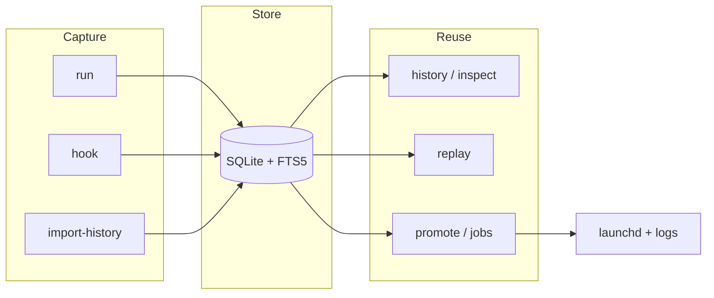

# Stillrun

English | [简体中文](README.zh-CN.md)

macOS CLI for **command history**, **safe replay**, and **launchd-backed Jobs**.

---

## Overview

Stillrun records terminal commands into a local searchable history. You can
replay them later, or promote useful commands into background Jobs managed by
launchd—with logs, status, and resource samples.

Stillrun complements your shell rather than replacing it.

| Use case | Commands |
| --- | --- |
| Remember and search past commands | `stillrun run` / `history` / `import-history` |
| Re-run a past command safely | `stillrun replay` |
| Keep a long-running task alive | `stillrun run --background` / `jobs` / `logs` |
| Auto-record future shell commands | `stillrun hook install` |

**Platform:** macOS only for background Jobs (launchd).  
**Not in scope:** TUI, Web UI, AI search, remote nodes, Linux / Windows Job backends.

---

## Installation

**Recommended:** Homebrew via [ingeniousfrog/homebrew-tap](https://github.com/ingeniousfrog/homebrew-tap).

```bash
brew tap ingeniousfrog/tap
brew install stillrun
```

Or install without tapping first:

```bash
brew install ingeniousfrog/tap/stillrun
```

Verify:

```bash
stillrun --version
stillrun -h
```

Upgrade / uninstall:

```bash
brew update && brew upgrade stillrun
brew uninstall stillrun
```

### Other install methods

| Method | Command |
| --- | --- |
| Source (interactive) | `./scripts/install.sh` |
| Source (non-interactive) | `cargo install --path .` |
| Dev binary | `cargo run -- <args>` |

Requires Rust **1.78+** for source builds. Packaging details: [`packaging/`](packaging/README.md).

---

## Getting Started

```bash
# Record a command
stillrun run -- printf 'hello stillrun\n'

# Find it
stillrun history --query hello
stillrun inspect 1

# Optional: import existing shell history
stillrun import-history --shell auto --preview
stillrun import-history --shell auto --yes

# Optional: auto-record future shell commands
stillrun hook install --shell auto
```

---

## Features

| Area | Commands | Description |
| --- | --- | --- |
| Run & record | `run` | Capture argv, cwd, Git, timing, exit status, stdout/stderr, redacted env |
| Shell wrapper | `run --shell` | Pipes, redirects, aliases, and functions via your login shell |
| History | `history` | FTS5 + substring search; filter by cwd, repo, branch, exit code, status, time; text or JSON |
| Import | `import-history` | Preview / import local zsh, bash, fish history |
| Replay | `replay` | Re-run from original cwd with recorded non-sensitive env |
| Promote | `promote` | Turn a past execution into a launchd Job |
| Jobs | `jobs`, `status`, `start`, `stop`, `restart` | Lifecycle, dashboard, samples, events, optional background monitor |
| Logs | `logs` | Tail or follow Job stdout/stderr |
| Inspect | `inspect` | Human or JSON view of an execution or Job |
| Config | `config` | Local TOML settings and redact-key management |
| Shell integration | `hook`, `completion` | Auto-record future commands; tab completion |

---

## Operational Workflows

### Execution and Query

```bash
stillrun run -- printf 'hello stillrun\n'
stillrun run --shell 'curl -s https://example.com | head -c 80'
stillrun history --query hello
stillrun history --status success --sort oldest
stillrun history --since 7d --branch main --exit-code 1 --json
stillrun inspect 1
stillrun inspect 1 --json
```

### Replay

```bash
stillrun replay 1 --preview
stillrun replay 1 --strict-context   # fail if cwd / Git context drifted
stillrun replay 1 --yes
```

### Background Job Lifecycle

```bash
stillrun run --background --name demo-tick -- \
  zsh -lc 'for i in 1 2 3; do echo tick-$i; sleep 1; done'

stillrun jobs
stillrun status demo-tick
stillrun logs demo-tick
stillrun jobs monitor demo-tick --once
stillrun stop demo-tick
stillrun jobs delete demo-tick
```

### Configuration and Shell Integration

```bash
stillrun config show
stillrun config redact add session_token
stillrun hook install --shell auto
stillrun completion zsh > ~/.stillrun-completion.zsh
```

---

## Architecture



Typical path: **record → search → replay or promote → manage Job**.

---

## Data Locations

```text
~/Library/Application Support/Stillrun/stillrun.db
~/Library/Application Support/Stillrun/logs/
~/Library/Application Support/Stillrun/config.toml
~/Library/LaunchAgents/com.stillrun.*.plist
```

| Variable | Purpose |
| --- | --- |
| `STILLRUN_HOME` | Override the Stillrun data directory |
| `STILLRUN_LAUNCH_AGENTS_DIR` | Override plist directory (tests / experiments) |

Isolate state while experimenting:

```bash
export STILLRUN_HOME=/tmp/stillrun-dev
stillrun run -- printf 'isolated\n'
stillrun history
```

---

## Security Boundaries

Stillrun redacts common secrets before writing to SQLite (env keys like
`token` / `password` / `api_key`, and patterns like `Authorization: Bearer ...`,
`token=...`, `--token value`).

- **Replay** restores recorded non-redacted env only—not your current shell.
  `--strict-context` fails if cwd is gone or Git branch/head no longer matches.
- **Imported** history requires `--preview` or `--yes` before replay.
- **Shell hooks** record command text, cwd, Git metadata, and exit code—not
  stdout/stderr. Use `stillrun run` or a Job for full output capture.
- **Background Jobs** refuse command-line secret values by default (launchd
  plists are files on disk). Pass references, not raw secrets.
- **Custom redact keys:** `stillrun config redact add KEY`.

---

## Development and Verification

```bash
cargo fmt --all --check
cargo clippy --all-targets -- -D warnings
cargo test
cargo build --release
```

Real launchd lifecycle E2E (touches the user launchd session):

```bash
STILLRUN_RUN_LAUNCHD_E2E=1 cargo test --test launchd_e2e -- --nocapture
```

---

## License

MIT — see [`LICENSE`](LICENSE).
