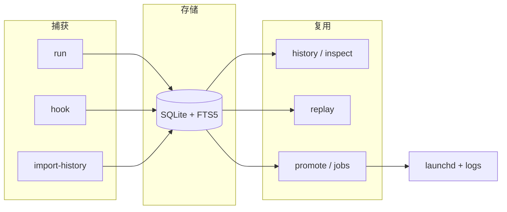

# Stillrun

[English](README.md) | 简体中文

面向 macOS 的 CLI：**命令历史**、**安全重放**、以及 **launchd 管理的后台 Job**。

---

## 概述

Stillrun 把终端命令记进本地可搜索的历史。之后可以安全重放，或把常用命令提升成
launchd 管理的后台 Job——带日志、状态和资源采样。

Stillrun 不取代你的 shell，而是作为补充与其并存。

| 用途 | 命令 |
| --- | --- |
| 记住并搜索过去的命令 | `stillrun run` / `history` / `import-history` |
| 安全重跑一条旧命令 | `stillrun replay` |
| 让长任务在后台跑 | `stillrun run --background` / `jobs` / `logs` |
| 自动记录之后的 shell 命令 | `stillrun hook install` |

**平台：** 后台 Job 仅支持 macOS（launchd）。  
**不在范围内：** TUI、Web UI、AI 搜索、远程节点、Linux / Windows 后台后端。

---

## 安装与分发

**推荐方式：** 通过 [ingeniousfrog/homebrew-tap](https://github.com/ingeniousfrog/homebrew-tap) 用 Homebrew 安装。

```bash
brew tap ingeniousfrog/tap
brew install stillrun
```

也可以不先 tap，直接安装：

```bash
brew install ingeniousfrog/tap/stillrun
```

验证：

```bash
stillrun --version
stillrun -h
```

升级 / 卸载：

```bash
brew update && brew upgrade stillrun
brew uninstall stillrun
```

### 其他安装方式

| 方式 | 命令 |
| --- | --- |
| 源码（交互） | `./scripts/install.sh` |
| 源码（非交互） | `cargo install --path .` |
| 开发态 | `cargo run -- <args>` |

源码安装需要 Rust **1.78+**。打包说明见 [`packaging/`](packaging/README.md)。

---

## 入门流程

```bash
# 记录一条命令
stillrun run -- printf 'hello stillrun\n'

# 搜出来
stillrun history --query hello
stillrun inspect 1

# 可选：导入本机已有 shell history
stillrun import-history --shell auto --preview
stillrun import-history --shell auto --yes

# 可选：自动记录之后的 shell 命令
stillrun hook install --shell auto
```

---

## 能力矩阵

| 能力 | 命令 | 说明 |
| --- | --- | --- |
| 运行并记录 | `run` | 捕获 argv、cwd、Git、耗时、退出码、stdout/stderr、脱敏后的环境 |
| Shell 包装 | `run --shell` | 用当前 shell 包装管道、重定向、alias、function |
| 历史 | `history` | FTS5 + 子串搜索；按 cwd、repo、branch、exit code、status、时间过滤；文本或 JSON |
| 导入 | `import-history` | 预览 / 导入本机 zsh、bash、fish history |
| 重放 | `replay` | 按原 cwd 与记录的非敏感环境重跑 |
| 提升 | `promote` | 把历史执行变成 launchd Job |
| Job | `jobs`、`status`、`start`、`stop`、`restart` | 生命周期、仪表盘、采样、事件、可选后台监控 |
| 日志 | `logs` | 查看或跟随 Job 的 stdout/stderr |
| 检查 | `inspect` | 文本或 JSON 查看 execution / Job |
| 配置 | `config` | 本地 TOML 与脱敏关键字管理 |
| Shell 集成 | `hook`、`completion` | 自动记录后续命令；补全脚本 |

---

## 操作工作流

### 执行与检索

```bash
stillrun run -- printf 'hello stillrun\n'
stillrun run --shell 'curl -s https://example.com | head -c 80'
stillrun history --query hello
stillrun history --status success --sort oldest
stillrun history --since 7d --branch main --exit-code 1 --json
stillrun inspect 1
stillrun inspect 1 --json
```

### 重放

```bash
stillrun replay 1 --preview
stillrun replay 1 --strict-context   # cwd / Git 上下文不一致时失败
stillrun replay 1 --yes
```

### 后台 Job 生命周期

```bash
stillrun run --background --name demo-tick -- \
  zsh -lc 'for i in 1 2 3; do echo tick-$i; sleep 1; done'

stillrun jobs
stillrun status demo-tick
stillrun logs demo-tick
stillrun jobs monitor demo-tick --once
stillrun stop demo-tick
stillrun jobs delete demo-tick
```

### 配置与 Shell 集成

```bash
stillrun config show
stillrun config redact add session_token
stillrun hook install --shell auto
stillrun completion zsh > ~/.stillrun-completion.zsh
```

---

## 架构总览



常见路径：**记录 → 搜索 → 重放或提升 → 管理 Job**。

---

## 数据位置

```text
~/Library/Application Support/Stillrun/stillrun.db
~/Library/Application Support/Stillrun/logs/
~/Library/Application Support/Stillrun/config.toml
~/Library/LaunchAgents/com.stillrun.*.plist
```

| 变量 | 作用 |
| --- | --- |
| `STILLRUN_HOME` | 覆盖 Stillrun 数据目录 |
| `STILLRUN_LAUNCH_AGENTS_DIR` | 覆盖 plist 目录（测试 / 实验） |

实验时可隔离状态：

```bash
export STILLRUN_HOME=/tmp/stillrun-dev
stillrun run -- printf 'isolated\n'
stillrun history
```

---

## 安全边界

Stillrun 写入 SQLite 前会脱敏常见 secret（如 `token` / `password` / `api_key`，
以及 `Authorization: Bearer ...`、`token=...`、`--token value` 等模式）。

- **Replay** 只恢复记录里的非敏感环境，不带当前 shell。`--strict-context` 会在
  cwd 不存在或 Git 分支/head 不一致时失败。
- **导入** 的历史在 replay 前需要 `--preview` 或 `--yes`。
- **Shell hook** 记录命令文本、cwd、Git 信息和退出码，不捕获 stdout/stderr。
  需要完整输出时用 `stillrun run` 或后台 Job。
- **后台 Job** 默认拒绝命令行里的 secret（launchd plist 会落盘）。请传引用，
  不要传明文。
- **自定义脱敏关键字：** `stillrun config redact add KEY`。

---

## 开发与验证

```bash
cargo fmt --all --check
cargo clippy --all-targets -- -D warnings
cargo test
cargo build --release
```

真实 launchd 生命周期 E2E（会触碰用户 launchd 会话）：

```bash
STILLRUN_RUN_LAUNCHD_E2E=1 cargo test --test launchd_e2e -- --nocapture
```

---

## 许可证

MIT — 见 [`LICENSE`](LICENSE)。
