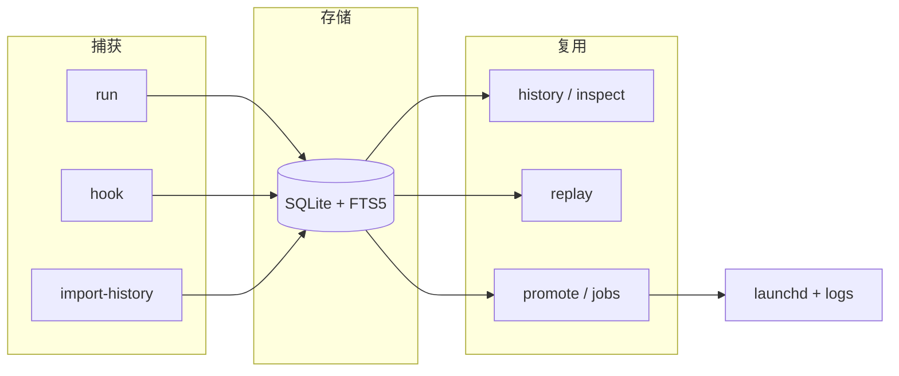
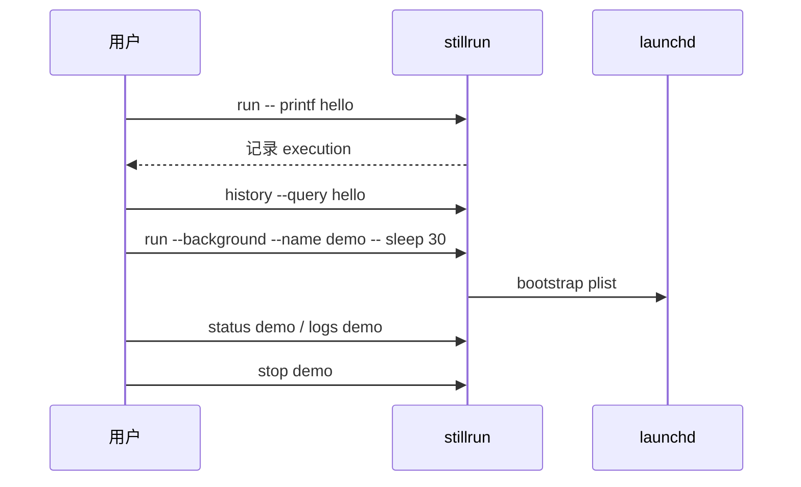

# Stillrun

[English](README.md) | 简体中文

面向 macOS 的 CLI：**命令历史**、**安全重放**、以及 **launchd 管理的后台 Job**。

---

## 概述

Stillrun 把终端命令变成可搜索、可检查的记录。常用命令可以提升成带日志、状态和资源采样的后台 Job——而不取代你现有的 shell。

**主要场景：** 可找回的命令历史、一次性或常驻后台任务、本地 Job 可观测性。

**不在范围内：** TUI / Web UI、AI 搜索、远程节点、Linux / Windows 后台后端（MVP 仅 macOS + launchd）。

敏感信息在落库前会脱敏。Replay 只恢复记录里的非敏感环境，不会带上你当前 shell 的环境。

---

## 功能

| 能力 | 命令 | 说明 |
| --- | --- | --- |
| 运行并记录 | `run` | 捕获 argv、cwd、Git 分支/head、耗时、退出码、stdout/stderr、脱敏后的环境 |
| Shell 包装 | `run --shell` | 用当前 shell 包装管道、重定向、alias、function 等复杂命令 |
| 历史 | `history` | FTS5 + 子串 fallback 搜索；按 cwd、repo、branch、exit code、status、时间过滤；支持文本或 JSON |
| 导入 | `import-history` | 预览 / 导入本机 zsh、bash、fish history |
| 重放 | `replay` | 按原 cwd 与记录的非敏感环境重跑 |
| 提升 | `promote` | 把历史执行变成 launchd Job |
| Job | `jobs`、`status`、`start`、`stop`、`restart` | 生命周期、仪表盘、进程树采样、事件、可选后台监控 |
| 日志 | `logs` | 查看或跟随 Job 的 stdout/stderr |
| 检查 | `inspect` | 文本或 JSON 查看 execution / Job |
| 配置 | `config` | 本地 TOML 与脱敏关键字管理 |
| Shell 集成 | `hook`、`completion` | 自动记录后续 shell 命令；补全脚本 |

---

## 快速开始

```bash
brew tap ingeniousfrog/tap
brew install stillrun
```

验证：

```bash
stillrun -h
stillrun run -- printf 'hello stillrun\n'
stillrun run --shell 'npm run dev 2>&1 | tee dev.log'
stillrun history --query hello
```

安装后可按需导入本机 shell history，并安装 shell hook：

```bash
stillrun import-history --shell auto --preview
stillrun hook install --shell auto
```

---

## 工作流



**常见路径：** 记录 → 搜索 → 重放或提升 → 管理 Job 生命周期。



---

## 安装

**当前版本：** `0.1.0`

| 方式 | 命令 |
| --- | --- |
| Homebrew | `brew tap ingeniousfrog/tap && brew install stillrun` |
| Homebrew 直接安装 | `brew install ingeniousfrog/tap/stillrun` |
| 源码交互安装 | `./scripts/install.sh` |
| 源码非交互安装 | `cargo install --path .` |
| 开发态 | `cargo run -- <args>` |

需要 Rust **1.78+**，以及 macOS（后台 Job 依赖 launchd）。

实验时可用独立数据目录：

```bash
export STILLRUN_HOME=/tmp/stillrun-dev
stillrun run -- printf 'isolated\n'
stillrun history
```

---

## 示例

```bash
# 记录前台命令
stillrun run -- printf 'hello stillrun\n'
stillrun run -- zsh -lc 'curl -s https://example.com | head -c 80'
stillrun run --shell 'npm run dev 2>&1 | tee dev.log'

# 搜索 / 检查
stillrun history --query hello
stillrun history --status success --sort oldest
stillrun history --since 7d --branch main --exit-code 1 --json
stillrun inspect 1
stillrun inspect 1 --json

# 导入 shell history（先预览）
stillrun import-history --shell auto --preview
stillrun import-history --shell auto --yes

# 重放
stillrun replay 1 --preview
stillrun replay 1 --strict-context
stillrun replay 1 --yes

# 后台 Job
stillrun run --background --name demo-tick -- zsh -lc 'for i in 1 2 3; do echo tick-$i; sleep 1; done'
stillrun jobs
stillrun status demo-tick
stillrun logs demo-tick
stillrun logs demo-tick --max-bytes 10485760
stillrun jobs monitor demo-tick --once
stillrun jobs monitor demo-tick --background --name demo-monitor --interval-secs 5
stillrun stop demo-tick
stillrun jobs delete demo-tick

# 配置与 shell 辅助
stillrun config show
stillrun hook install --shell auto
stillrun completion zsh > ~/.stillrun-completion.zsh
```

---

## 存储

默认路径：

```text
~/Library/Application Support/Stillrun/stillrun.db
~/Library/Application Support/Stillrun/logs/
~/Library/Application Support/Stillrun/config.toml
~/Library/LaunchAgents/com.stillrun.*.plist
```

| 变量 | 作用 |
| --- | --- |
| `STILLRUN_HOME` | 覆盖 Stillrun 数据目录 |
| `STILLRUN_LAUNCH_AGENTS_DIR` | 覆盖 plist 目录（测试 / 实验） |

---

## 安全

Stillrun 写入 SQLite 前会脱敏常见 secret：环境变量名如 `token` / `password` / `api_key`，以及 `Authorization: Bearer ...`、`token=...`、`--token value` 等内联模式。

- **Replay** 会清空当前进程环境，再恢复记录中的非脱敏值。`--strict-context`
  会在原 cwd 不存在或当前 Git 分支/head 与记录不一致时快速失败；Stillrun
  不会自动 checkout Git 状态、恢复 TTY，或重建 shell alias/function，除非命令本身是以 shell 命令形式捕获的。
- **导入** 的历史在 replay 前需要 `--preview` 或 `--yes`。
- **Shell hook** 记录命令文本、cwd、Git 信息和退出码，不捕获 stdout/stderr。需要完整输出时请用 `stillrun run` 或后台 Job。
- **后台 Job** 默认拒绝命令行里的 secret 值，因为 launchd plist 是落盘文件。请把 secret 放到外部运行时来源或 secret manager，再传引用。
- **自定义脱敏关键字** 通过 `stillrun config redact add KEY` 添加后，会用于环境捕获、argv/命令持久化、stdout/stderr 脱敏。前台运行时，当前进程里的敏感 env 值也会从捕获输出里擦除。

---

## 开发

```bash
cargo fmt --all --check
cargo clippy --all-targets -- -D warnings
cargo test
cargo build --release
```

Release 打包和 Homebrew tap 维护说明见 [`packaging/`](packaging/README.md)。

真实 launchd 生命周期 E2E（会触碰用户 launchd 会话）：

```bash
STILLRUN_RUN_LAUNCHD_E2E=1 cargo test --test launchd_e2e -- --nocapture
```

---

## 许可证

MIT — 见 [`LICENSE`](LICENSE)。
